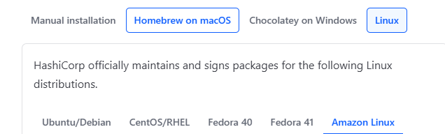

# Terraform-with-docker

## Prerequisites:

**Manual installation** :
1. Terraform
2. Docker

As i am using linux os, install the package from official website 
#### **Link**

🔗  https://developer.hashicorp.com/terraform/tutorials/aws-get-started/install-cli


🚀 Select the package which you want to install based on the OS
then follow the installation steps,

📌 Install yum-config-manager to manage your repositories.

     $ sudo yum install -y yum-utils

📌 Use yum-config-manager to add the official HashiCorp Linux repository.

     $ sudo yum-config-manager --add-repo https://rpm.releases.hashicorp.com/AmazonLinux/hashicorp.repo

🛠️ Install Terraform from the new repository.

     $ sudo yum -y install terraform

✅ installation is completed, check the version
terraform -version

*Install docker*
```sh
yum install docker -y
systemctl start docker 
sudo systemctl enable docker  # Ensures Docker starts on boot
sudo usermod -aG docker ec2 # Add ec2-user to the docker group
newgrp docker
```

 🏁  docker images  # check the nginx image

 🏁  docker ps   # check the running nginx container

create directory and execute the files by 
```sh
terraform init
terraform validate
terraform plan
terraform apply
```
⚡ Try to access the nginx container
 ####  **Internally expose**
```sh   
*curl localhost* on the terminal

      or  

docker exec -it <container id> /bin/bash

go inside the container and check with *curl localhost*

```
  ####  **Externally expose**
```sh
<public_IP>:80 # check it on browser
```
🎯 Deploy Your Application

